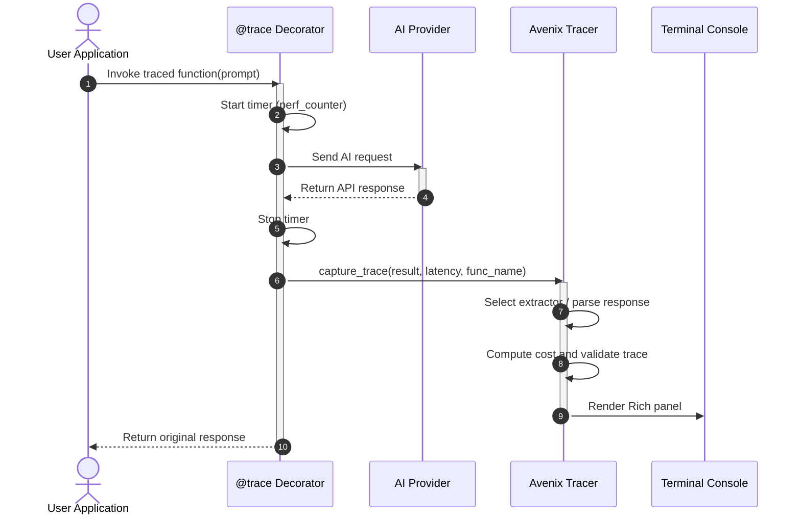
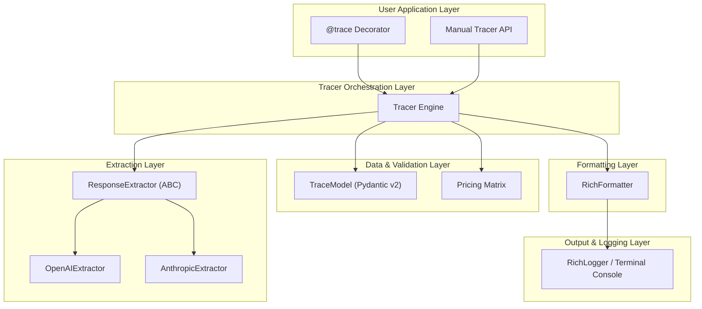

<div align="center">
    
# 🚀 Avenix

**A lightweight, type-safe Python tracing library for AI & LLM requests with breathtaking terminal output.**

[](https://www.python.org)
[](https://docs.pydantic.dev/)
[](https://github.com/Textualize/rich)
[](https://opensource.org/licenses/MIT)
[](https://github.com/avenix/avenix)
[](https://hypothesis.readthedocs.io/)

<br />

<br />

---

*Say goodbye to messy print statements and clunky cloud observability dashboards when debugging LLM apps.<br>Avenix gives you instant, structured terminal traces with zero setup.*

[Key Features](#-key-features) •
[Terminal Preview](#-terminal-preview) •
[Architecture & Workflows](#-architecture--workflows) •
[Quick Start](#-quick-start) •
[Supported Models & Pricing](#-supported-models--pricing) •
[API Reference](#-api-reference)

</div>

---

## 🌟 Overview

As LLM applications grow in complexity, developers need immediate visibility into model performance, token consumption, latency, and costs without configuring heavyweight observability platforms or leaking API keys to third-party dashboards.

**Avenix** solves this by providing a hyper-focused, non-intrusive tracing solution that lives right in your local development environment:
1. **Zero-Configuration Tracing**: Simply wrap any LLM function with the `@trace` decorator.
2. **Automated Intelligence**: Automatically captures timing metrics via high-resolution `perf_counter`, extracts token usage, and computes real-time request costs.
3. **Stunning Visual Display**: Renders trace data in a rich, color-coded terminal panel using [Rich](https://github.com/Textualize/rich).
4. **Multi-Provider Support**: Seamlessly parses responses from **OpenAI** and **Anthropic** out of the box, with an extensible architecture for adding custom providers.

---

## 🎨 Terminal Preview

Here is what you see in your terminal when an Avenix-traced function executes:

```
╭────────────────────────────── 🚀 Avenix Trace ───────────────────────────────╮
│                                                                              │
│  Model:    gpt-4                                                             │
│  Latency:  1.23s                                                             │
│  Input:    150 tokens                                                        │
│  Output:   300 tokens                                                        │
│  Cost:     $0.0225                                                           │
│                                                                              │
│  ━━━━━━━━━━━━━━━━━━━━━━━━━━━━━━━━━━━━━━━━━━━━━━━━━━━━━━━━━━━━━━━━━━━━━━━━━━  │
│  Prompt                                                                      │
│  ━━━━━━━━━━━━━━━━━━━━━━━━━━━━━━━━━━━━━━━━━━━━━━━━━━━━━━━━━━━━━━━━━━━━━━━━━━  │
│  Explain quantum computing and its primary advantages over classical         │
│  supercomputers in two concise paragraphs.                                   │
│                                                                              │
│  ━━━━━━━━━━━━━━━━━━━━━━━━━━━━━━━━━━━━━━━━━━━━━━━━━━━━━━━━━━━━━━━━━━━━━━━━━━  │
│  Response                                                                    │
│  ━━━━━━━━━━━━━━━━━━━━━━━━━━━━━━━━━━━━━━━━━━━━━━━━━━━━━━━━━━━━━━━━━━━━━━━━━━  │
│  Quantum computing leverages the fundamental principles of quantum           │
│  mechanics—specifically superposition and entanglement—to process data in    │
│  ways classical computers cannot. While classical bits represent either a 0  │
│  or a 1, quantum bits (qubits) can exist in multiple states simultaneously... │
│                                                                              │
╰──────────────────────────────────────────────────────────────────────────────╯
```

---

## ✨ Key Features

| Feature | Description |
| :--- | :--- |
| ⚡ **Decorator-Based API** | Simply add `@trace` above your functions. Zero modification to your existing model invocation code or return values. |
| 💰 **Automated Cost Calculation** | Built-in pricing engine accurately calculates request costs in USD down to 4 decimal places based on model pricing tables. |
| 🎯 **Precision Latency Tracking** | Utilizes Python's `time.perf_counter()` to capture microsecond-accurate execution latency. |
| 🛡️ **Type-Safe & Validated** | All trace records are strictly typed and validated using **Pydantic v2**, ensuring rock-solid data integrity. |
| 🔌 **Extensible Extractor Chain** | Includes native parsers for OpenAI and Anthropic Claude models, with abstract base classes for custom integrations. |
| 🏗️ **Resilient Architecture** | Built with graceful fallbacks. If extraction or rendering fails, your application code executes uninterrupted without exception suppression. |
| 🧪 **Property-Based Tested** | Verified using comprehensive property-based testing via **Hypothesis** across 16 correctness invariants. |

---

## 🏗️ Architecture & Workflows

Avenix is built from the ground up using modern software engineering best practices, emphasizing clean separation of concerns, strict typing, and fault tolerance.
### 1. Tracing Data Flow Lifecycle

The following diagram illustrates the lifecycle of a request passing through an Avenix-traced function:


### 2. Runtime Interaction Sequence

When an application invokes a traced function, Avenix orchestrates timing, extraction, and rendering while preserving the original return payload:



### 3. Layered Component Architecture

Avenix enforces a strict 6-layer modular architecture to guarantee extensibility and maintainability:



---

## 📦 Installation

Install Avenix directly from PyPI using pip or your preferred package manager:

```bash
pip install avenix
```

Or using **Poetry** / **UV**:

```bash
poetry add avenix
# or
uv pip install avenix
```

### Requirements
- **Python**: `>= 3.11`
- **Pydantic**: `>= 2.0, < 3.0`
- **Rich**: `>= 13.0, < 14.0`

---

## 🚀 Quick Start

### 1. Using the `@trace` Decorator (Recommended)

The simplest and most powerful way to use Avenix is by attaching `@trace` to your function:

```python
from avenix import trace
from openai import OpenAI

client = OpenAI()

@trace
def ask_gpt(prompt: str):
    """Call OpenAI GPT-4 with automated terminal tracing."""
    response = client.chat.completions.create(
        model="gpt-4",
        messages=[{"role": "user", "content": prompt}]
    )
    return response

# When called, Avenix automatically captures latency, token usage,
# calculates pricing, and prints the visual trace panel to your terminal!
result = ask_gpt("Explain the difference between synchronous and asynchronous programming.")
```

### 2. Using with Anthropic Claude

Avenix automatically detects whether the return payload belongs to OpenAI or Anthropic:

```python
from avenix import trace
from anthropic import Anthropic

client = Anthropic()

@trace
def ask_claude(prompt: str):
    """Call Anthropic Claude 3 Opus with automated terminal tracing."""
    response = client.messages.create(
        model="claude-3-opus-20240229",
        max_tokens=1024,
        messages=[{"role": "user", "content": prompt}]
    )
    return response

result = ask_claude("What are the core design patterns of microservices?")
```

### 3. Manual Tracing API

When working with custom AI pipelines, background jobs, or proprietary APIs, you can instantiate the `Tracer` directly to create explicit traces:

```python
from avenix import Tracer
import time

tracer = Tracer()

# Measure custom execution
start_time = time.perf_counter()
# ... custom pipeline logic ...
latency = time.perf_counter() - start_time

# Manually generate and render the trace panel
tracer.create_trace(
    model="custom-meta-llama-3-70b",
    latency=latency,
    input_tokens=450,
    output_tokens=820,
    cost=0.0038,
    prompt="Summarize the latest advancements in solid-state battery technology.",
    response="Solid-state batteries replace liquid electrolytes with solid counterparts..."
)
```

---

## 💵 Supported Models & Pricing

Avenix includes a built-in cost calculation engine updated with standard provider pricing rates. Costs are calculated automatically per 1,000 tokens:

$$\text{Total Cost} = \left(\frac{\text{Input Tokens}}{1000} \times \text{Input Price}\right) + \left(\frac{\text{Output Tokens}}{1000} \times \text{Output Price}\right)$$

| Provider | Model Identifier | Input Price ($ / 1K Tokens) | Output Price ($ / 1K Tokens) | Ideal Use Case |
| :--- | :--- | :---: | :---: | :--- |
| **OpenAI** | `gpt-4` | $0.03000 | $0.06000 | Complex reasoning, code generation, advanced analysis |
| **OpenAI** | `gpt-4-turbo` | $0.01000 | $0.03000 | High-performance multimodal reasoning at lower latency |
| **OpenAI** | `gpt-3.5-turbo` | $0.00050 | $0.00150 | Fast, lightweight tasks, formatting, and classification |
| **Anthropic** | `claude-3-opus` | $0.01500 | $0.07500 | Top-tier intelligence and nuanced creative writing |
| **Anthropic** | `claude-3-sonnet` | $0.00300 | $0.01500 | Balanced capability and speed for enterprise workloads |
| **Anthropic** | `claude-3-haiku` | $0.00025 | $0.00125 | Near-instantaneous response times and high-volume parsing |

> *Note: If an unknown or custom model string is encountered, Avenix gracefully defaults the calculated cost to `$0.0000` without throwing an error.*

---

## 🛠️ API Reference

### `@trace` Decorator
Wraps any synchronous function that returns an AI model response object.
- **Behavior**:
  - Captures execution duration via `time.perf_counter()`.
  - Invokes the global `Tracer` instance to inspect the return value.
  - Renders the terminal panel without altering the function's return payload.
  - Fully transparent to exceptions (errors in the underlying function propagate normally).

### `Tracer` Class
```python
from avenix import Tracer

tracer = Tracer(logger=None, formatter=None)
```
- **Parameters**:
  - `logger`: Optional custom logging class (defaults to built-in `RichLogger`).
  - `formatter`: Optional custom formatting class (defaults to built-in `RichFormatter`).
- **Methods**:
  - `capture_trace(result: Any, latency: float, func_name: Optional[str] = None) -> None`: Inspects an arbitrary result object using the extractor chain and outputs the trace.
  - `create_trace(model: str, latency: float, input_tokens: int, output_tokens: int, cost: float, prompt: str, response: str) -> None`: Validates and displays an explicitly defined trace record.

### `TraceModel` (Pydantic v2 Schema)
Represents the validated data structure of an execution trace:
```python
class TraceModel(BaseModel):
    model: str          # Name of the AI model
    latency: float      # Execution time in seconds (ge=0.0, rounded to 2 decimals)
    input_tokens: int   # Number of prompt tokens (ge=0)
    output_tokens: int  # Number of completion tokens (ge=0)
    cost: float         # Computed request cost in USD (ge=0.0, rounded to 4 decimals)
    prompt: str = ""    # Input prompt text
    response: str = ""  # Output completion text
```

---

## 🧪 Testing & Quality Assurance

Avenix is built with uncompromising quality standards, featuring both unit tests and property-based testing with [Hypothesis](https://hypothesis.readthedocs.io/).

To run the local test suite:

```bash
# Clone the repository
git clone https://github.com/avenix/avenix.git
cd Avenix

# Install with development dependencies
pip install -e ".[dev]"

# Execute unit and property tests
pytest tests/ -v

# Run with HTML and terminal coverage reporting
pytest tests/ --cov=avenix
```

### Test Suite Highlights:
- **Core Coverage**: >90% code coverage across decorators, extractors, formatters, and models.
- **Property-Based Invariants**: 16 dedicated property tests ensuring precision rounding, non-negative token counts, and cost calculation correctness across arbitrary data distributions.

---

## 🗺️ Roadmap & Out of Scope (v0.1)

Avenix v0.1 is intentionally designed as a lightweight, zero-dependency (beyond Pydantic/Rich) local developer tool. The following features are planned for future major releases:

- [ ] **Async/Await Support**: Native `@trace_async` decorator for `asyncio` pipelines and streaming responses.
- [ ] **Custom Formatter Plugins**: Support for JSON, compact ASCII, and Markdown file exporters.
- [ ] **Local Persistence**: Optional SQLite or JSONL local trace logging for historical session review.
- [ ] **Additional Providers**: Built-in extractors for Google Gemini, Mistral, Cohere, and Ollama/LocalLLMs.
- [ ] **Usage Aggregation**: Session-wide token and budget counters with quota warnings.

---

## 🤝 Contributing

We welcome contributions from the developer community! Whether it is adding a new model extractor, enhancing terminal aesthetics, or improving documentation:

1. Fork the Project.
2. Create your Feature Branch (`git checkout -b feature/AmazingFeature`).
3. Run the test suite (`pytest tests/`) to verify all property tests pass.
4. Commit your Changes (`git commit -m 'Add some AmazingFeature'`).
5. Push to the Branch (`git push origin feature/AmazingFeature`).
6. Open a Pull Request.

---

## 📄 License

Distributed under the **MIT License**. See [`LICENSE`](file:///home/adityalp/Documents/avenix/Avenix/LICENSE) for more information.

---

<div align="center">
  <b>Built with ❤️ by the Avenix Contributors.</b><br>
  <i>Elevate your terminal observability today!</i>
</div>
